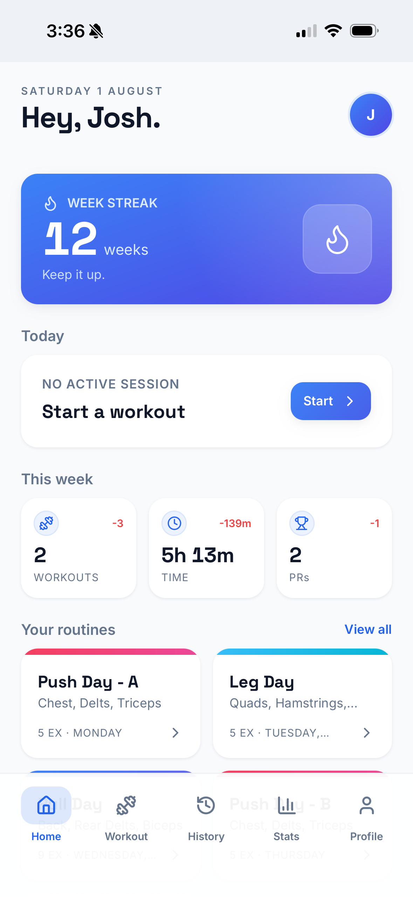
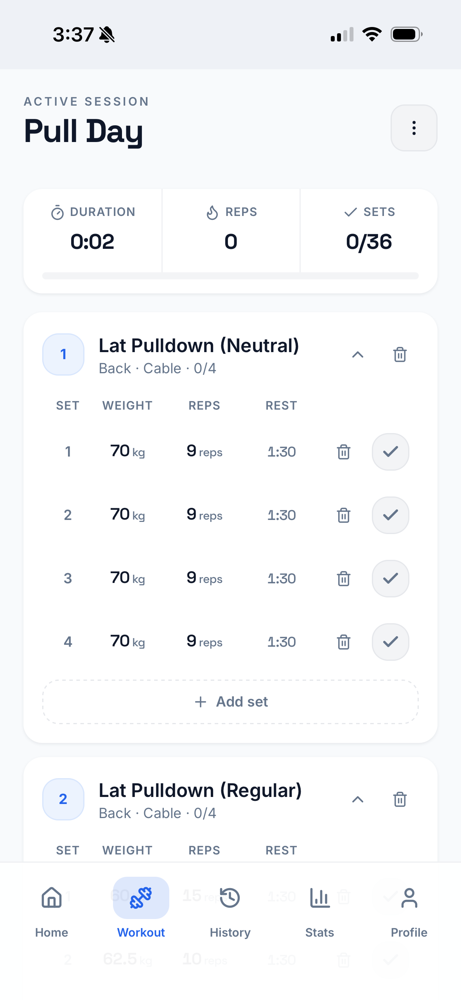
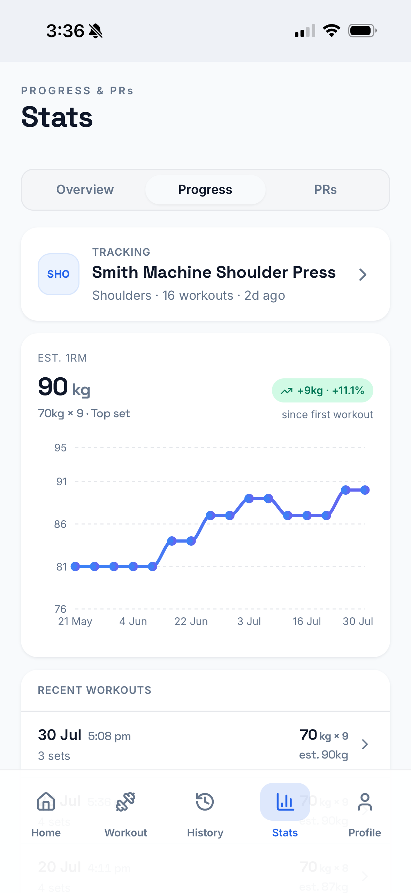
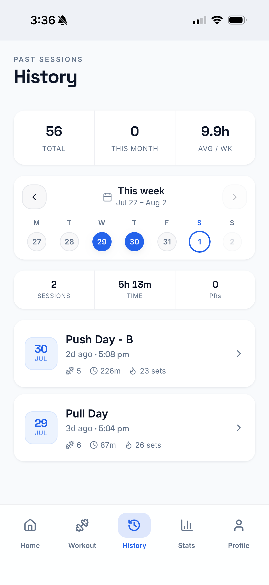
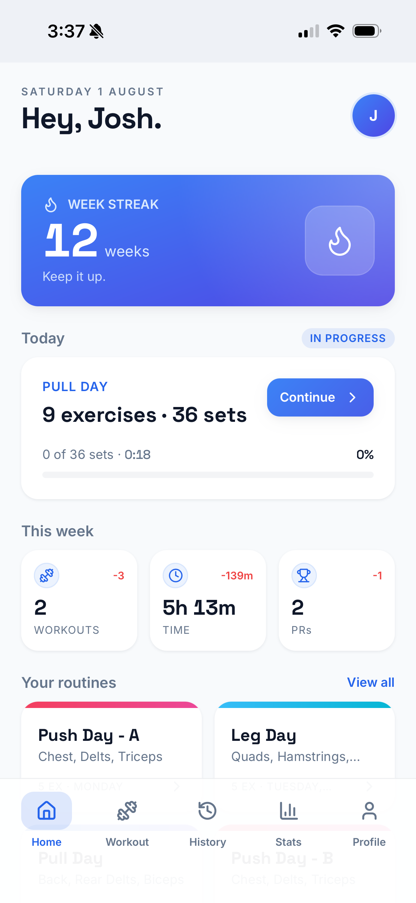
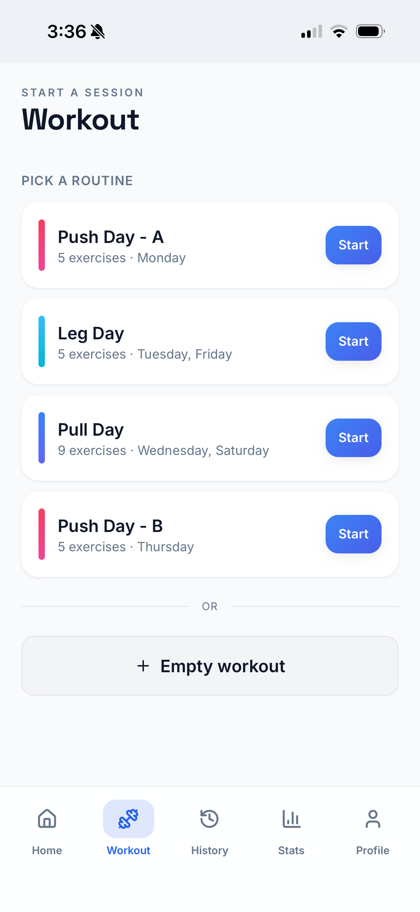
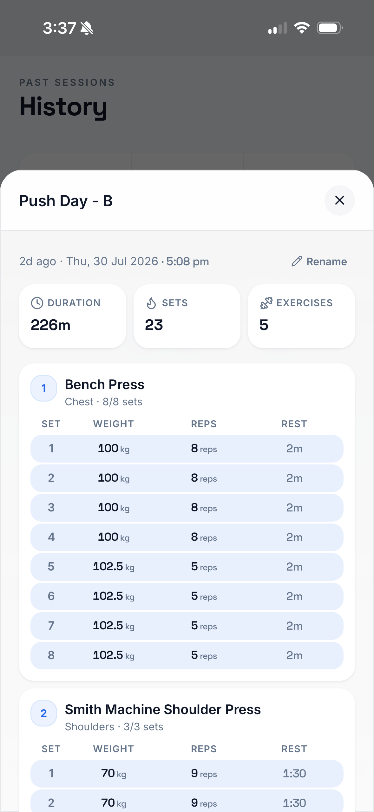
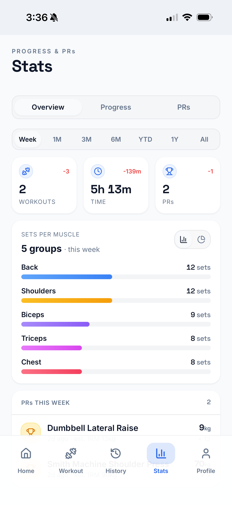
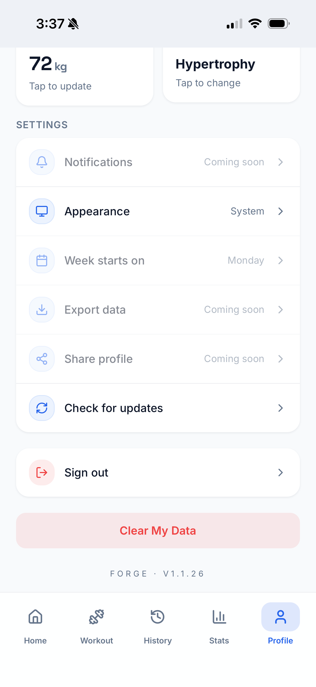

<div align="center">


# Forge

**A workout tracker for people who actually lift.**

Build routines, log every set, and watch your estimated 1RM climb. Installable as a PWA on any phone.

### [→ Try it live](https://forge-workout-io.vercel.app/)

<p>
  
  
  
  
  
  
</p>

<table>
  <tr>
    <td></td>
    <td></td>
    <td></td>
    <td></td>
  </tr>
</table>

</div>

---

## Install it on your phone

Forge is a PWA, so there's no app store — you install it straight from the browser and it behaves like a native app: its own home-screen icon and fullscreen with no browser chrome.

Open **[forge-workout-io.vercel.app](https://forge-workout-io.vercel.app/)** on your phone, then:

| Device | Steps |
|---|---|
| **iPhone / iPad** | In **Safari**, tap the **Share** button at the bottom → scroll down → **Add to Home Screen** → **Add**. |
| **Android** | In **Chrome**, tap the **⋮** menu (top right) → **Install app** (or **Add to Home screen**) → **Install**. |
| **Desktop** | In Chrome or Edge, click the **install icon** at the right of the address bar → **Install**. |

> On iOS this only works in Safari — the Add to Home Screen option won't appear in other browsers.

Launch it from your home screen from then on. To update, pull up *Profile → Check for updates*.

---

## Features

### Train

| | |
|---|---|
| **Routines** | Build reusable routines with target sets and reps per exercise, drag to reorder, and schedule them to weekdays. |
| **Active sessions** | Log weight, reps and rest per set; add or delete sets and exercises mid-workout; collapse finished exercises. |
| **Rest timer** | Per-set countdown that keeps running in the background, with a two-note chime and haptic buzz on completion. |
| **Quick start** | Start from a routine or spin up an empty session and add exercises as you go. |
| **Exercise library** | Search a seeded catalogue by muscle group and equipment, add your own, or rename any of them. |

### Review

| | |
|---|---|
| **History** | Week-by-week calendar with per-week sessions, time and PR counts; jump to any month. |
| **Session detail** | Full set-by-set breakdown of any past workout — weight, reps and rest for every set — plus inline rename. |
| **Overview stats** | Workouts, time and PRs for the selected period (Week → All), with week-over-week deltas. |
| **Muscle balance** | Sets-per-muscle-group breakdown as bars or a donut, so you can see what you're neglecting. |
| **Progress** | Pick any trained exercise and chart its estimated 1RM over time, with total gain since your first session. |
| **Personal records** | PRs recorded automatically per exercise from weight × reps, surfaced on Home and in Stats. |

### Platform

| | |
|---|---|
| **Installable** | Standalone PWA with maskable icons, precached app shell and a prompt-to-update service worker. |
| **Appearance** | Light, dark or follow-system. |
| **Accounts** | Email + password or Google OAuth, with per-user row-level security and cache eviction on account switch. |

---

## Screens

<table>
  <tr>
    <td align="center" width="33%"><br /><sub><b>Home</b><br />Week streak, this-week deltas, routines</sub></td>
    <td align="center" width="33%"><br /><sub><b>Session in progress</b><br />Resume right where you left off</sub></td>
    <td align="center" width="33%"><br /><sub><b>Start a workout</b><br />Pick a routine or go empty</sub></td>
  </tr>
  <tr>
    <td align="center"><br /><sub><b>Active session</b><br />Set-by-set logging + rest timer</sub></td>
    <td align="center"><br /><sub><b>History</b><br />Weekly calendar and past sessions</sub></td>
    <td align="center"><br /><sub><b>Session detail</b><br />Every set, weight, rep and rest</sub></td>
  </tr>
  <tr>
    <td align="center"><br /><sub><b>Stats — Overview</b><br />Workouts, time, PRs, muscle balance</sub></td>
    <td align="center"><br /><sub><b>Stats — Progress</b><br />Estimated 1RM per exercise</sub></td>
    <td align="center"><br /><sub><b>Profile</b><br />Body stats, goal, settings</sub></td>
  </tr>
</table>

---

## Tech stack

| Layer | Choice |
|---|---|
| Framework | React 19 + TypeScript, built with Vite 8 |
| Styling | Tailwind CSS 3 with HSL design tokens in `src/index.css` |
| Components | Hand-rolled shadcn-style primitives in `src/components/ui` (no Radix dependency) |
| Charts | Recharts |
| Icons | lucide-react |
| Drag & drop | dnd-kit (routine and exercise ordering) |
| Backend | Supabase — Postgres, Auth, row-level security |
| Persistence | IndexedDB (`src/lib/idb.ts`) for cache + mutation queue |
| PWA | vite-plugin-pwa / Workbox |

---

## Architecture

### Data layer

`src/lib/api.ts` exposes one hook per view (`useStats`, `useRecentWorkouts`, `useExerciseProgress`, …). Reads hit an in-memory cache, fall back to a versioned IndexedDB cache (`src/lib/cache.ts`), and revalidate from Supabase in the background. Cache keys are namespaced per user id, so signing out or switching accounts evicts the previous user's entries.

Writes go through `src/lib/mutation-queue.ts`, a persisted queue that applies changes optimistically and reconciles with the server. Each mutation serializes to a plain payload — no closures, no React state — so it survives a reload and can be replayed by a fresh client. Inserts pre-generate their UUIDs client-side, which keeps optimistic UI and foreign keys between queued rows consistent. Failed entries retry up to five times before surfacing.

### Service worker

The app shell is precached; fonts and static assets use stale-while-revalidate. Supabase REST and auth requests are deliberately `NetworkOnly` — letting the SW serve a stale pre-mutation snapshot would overwrite optimistic state (a freshly finished workout would vanish from History). Updates use `registerType: 'prompt'`, surfaced through *Profile → Check for updates*.

### Data model

Row-level security is enforced throughout. Top-level tables own a `user_id` checked against `auth.uid()`; child tables (`routine_exercises`, `workout_exercises`, `sets`) inherit ownership through their parent foreign key. Shared seed exercises have a null `user_id` and are readable by everyone.

```
profiles            body stats, goal, display name
exercises           shared catalogue + user-created
exercise_overrides  per-user renames of shared exercises
routines            name, schedule, colour, position
  └─ routine_exercises   target sets/reps, position
workouts            title, started_at, ended_at, duration_min, volume_kg, routine link
  └─ workout_exercises   position, notes
       └─ sets             set_number, weight_kg, reps, rest_seconds, rpe, done

personal_records    view — best weight × reps per exercise → estimated_1rm, achieved_at
```

---

## Getting started

### Prerequisites

- Node 20+
- A [Supabase](https://supabase.com) project

### Install

```bash
git clone https://github.com/joshpanebianco-io/forge-workout-tracker.git
cd forge-workout-tracker
npm install
```

### Configure

Copy the example env file and fill in your project credentials:

```bash
cp .env.example .env.local
```

```env
VITE_SUPABASE_URL=https://your-project-ref.supabase.co
VITE_SUPABASE_ANON_KEY=sb_publishable_xxx
```

Both are found in your Supabase dashboard under **Project Settings → API**. `.env.local` is gitignored.

### Run

```bash
npm run dev      # dev server on http://localhost:5173 (exposed on your LAN via --host)
npm run build    # type-check with tsc -b, then build to dist/
npm run preview  # serve the production build locally
npm run lint     # eslint
npm run icons    # regenerate PWA icons from the source SVG
```

> **Testing on your phone:** `npm run dev` binds to your network, so open `http://<your-lan-ip>:5173` on your phone and add it to your home screen. Service workers need HTTPS or localhost, so for full PWA behaviour test against a deployed build.

---

## Project structure

```
src/
├── App.tsx                  tab routing, auth gate, lazy-loaded screens
├── index.css                design tokens (light + dark)
├── screens/
│   ├── Home.tsx             streak, active session, week deltas, routines
│   ├── Workout.tsx          active session: set logging, rest timer
│   ├── History.tsx          weekly calendar + past sessions
│   ├── Stats.tsx            overview / progress / PRs
│   ├── Profile.tsx          body stats, settings
│   └── Login.tsx            email+password and Google sign-in
├── components/
│   ├── ui/                  Button, Card, Sheet, Tabs, Input, …
│   ├── AppShell.tsx         DeviceFrame + BottomNav wrapper
│   ├── DeviceFrame.tsx      phone bezel on desktop, fullscreen on mobile
│   └── *Sheet.tsx           bottom-sheet flows (routines, exercises, sets, …)
└── lib/
    ├── api.ts               all Supabase queries + data hooks
    ├── mutation-queue.ts    persisted write queue
    ├── cache.ts             versioned, user-scoped IndexedDB read cache
    ├── idb.ts               thin IndexedDB wrapper
    ├── session.tsx          active-session + rest-timer state
    ├── auth.tsx             AuthProvider, useAuth
    ├── network.tsx          online/offline detection
    ├── sw-update.tsx        service-worker update prompt
    └── theme.tsx            light / dark / system
```

On desktop the app renders inside a 412×880 phone bezel (`DeviceFrame.tsx`); on mobile and when installed it fills the screen.

---

## Roadmap

- [ ] Push notifications for rest timers
- [ ] Data export (CSV / JSON)
- [ ] Shareable profile and session cards
- [ ] Plate calculator
- [ ] Apple Health / Google Fit sync

---

<div align="center">
<sub>Built by <a href="https://github.com/joshpanebianco-io">Josh Panebianco</a></sub>
</div>
